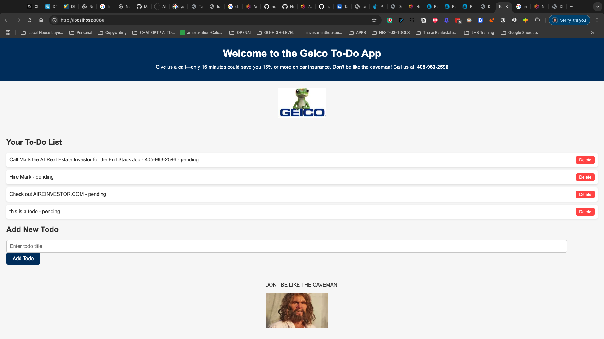

Here’s a refined version of the README, tailored specifically for Geico. It focuses on aligning the project with their role requirements and demonstrates how this learning project will directly contribute to their business transformation goals:

---

# Learn Go - From Beginner to Expert 🚀  
_A Tailored Initiative for Geico's Engineering Excellence_

Welcome to the **Learn Go** repository! This project documents my journey to mastering the Go programming language, designed to directly align with Geico's mission of building high-performance, low-maintenance, and zero-downtime platforms.

---

## 🏆 **Objective**

This repository demonstrates my commitment to:  
1. Rapidly learning and applying Go programming to meet enterprise-level requirements.  
2. Delivering a **Minimum Viable Product (MVP)** showcasing Go's capabilities in a practical, insurance-focused context.  
3. Establishing efficient DevOps pipelines to ensure scalable and reliable deployments.  
4. Developing skills to contribute meaningfully as part of a high-performing engineering team.  

This project directly reflects the values and goals outlined in Geico’s Staff Engineer position, particularly focusing on:  
- **Go-based microservices.**  
- **System design and scalability.**  
- **Integration with cloud-native platforms (AWS/GCP).**  

---

## 📂 **Repository Structure**

### **1. Getting Started**  
- **Overview of Go**: Setting up Go for high-impact development.  
- **Environment Setup**: Installing Go, Docker, Kubernetes, and other essential tools.  

### **2. Language Mastery**  
- **Core Syntax**: Understanding Go's efficient and minimalist design.  
- **Concurrency in Go**: Utilizing goroutines and channels for scalable applications.  
- **Error Handling**: Building fault-tolerant systems with Go's error-handling mechanisms.  

### **3. Building Insurance Solutions**  
- **API Development**: Creating RESTful APIs tailored for insurance workflows.  
- **Database Integration**: Leveraging PostgreSQL and MongoDB for policy and customer management.  
- **Cloud-Native Microservices**: Designing services with a focus on scalability and resilience.  

### **4. DevOps Excellence**  
- **CI/CD Pipelines**: Automating builds, testing, and deployments with GitHub Actions.  
- **Containerization**: Using Docker and Kubernetes for portable and efficient deployment.  
- **Infrastructure as Code (IaC)**: Managing cloud resources using Terraform.  

### **5. MVP Showcase**  
- A fully functional **Policy Management System**, designed to demonstrate Go’s ability to handle real-world insurance needs.  

---

## 🔥 **Minimum Viable Product (MVP)**  
### **Concept**  
The MVP focuses on addressing key needs in the insurance domain by implementing a **Policy Management System** that:  
1. **Tracks Insurance Policies**: Full CRUD capabilities for policies.  
2. **Manages Customer Data**: Secure storage and retrieval of sensitive customer information.  
3. **Processes Claims**: A lightweight claims workflow to initiate and monitor claims.  

### **Tech Stack**  
- **Backend**: Go (Golang) for high-performance API development.  
- **Frontend**: React with Next.js to deliver an intuitive user experience.  
- **Database**: PostgreSQL for relational data and MongoDB for flexible document storage.  
- **DevOps**: Docker, Kubernetes, and Terraform to ensure seamless deployments.

### **Pipeline Overview**  
1. **Development**:  
   - Local development environment using Docker.  
   - Comprehensive unit and integration testing with Go’s native testing tools.  
2. **CI/CD**:  
   - Continuous integration via GitHub Actions.  
   - Automated deployments with Kubernetes and Terraform.  
3. **Production**:  
   - Deployed to a scalable cloud environment (AWS/GCP/Azure).  

---

## 🧑‍💻 **How This Project Elevates Geico**

### **Alignment with Geico’s Needs**  
This project demonstrates my ability to meet the qualifications outlined in the Staff Engineer role:  
1. **Proficiency in Go**: Building scalable, enterprise-ready applications.  
2. **Cloud Expertise**: Leveraging AWS/GCP for high-performance deployments.  
3. **Microservices**: Creating modular, reusable services for seamless integrations.  
4. **CI/CD Excellence**: Automating workflows for efficient and zero-downtime releases.  

### **Innovative Solutions for Insurance**  
By focusing on a Policy Management System, this project addresses Geico’s core business needs:  
- **Policy Tracking**: Ensures accurate and accessible data for policy management.  
- **Claims Processing**: Simplifies workflows for faster and more reliable claim handling.  
- **Scalability**: Builds infrastructure capable of handling millions of users with low latency.  

---

## 📧 **Contact**  

Mark Carpenter  
📞 405-308-0560  
📧 Info@theaireinvestor.com  
🌐 [LinkedIn](https://www.linkedin.com/in/mark-carpenter-573b4b76/)  

---

This repository reflects my dedication to mastering Go and contributing to Geico’s goals with innovative, scalable, and robust solutions. I am eager to bring this level of initiative and technical capability to your team.  

**Looking forward to hearing your thoughts and feedback!**  

---

